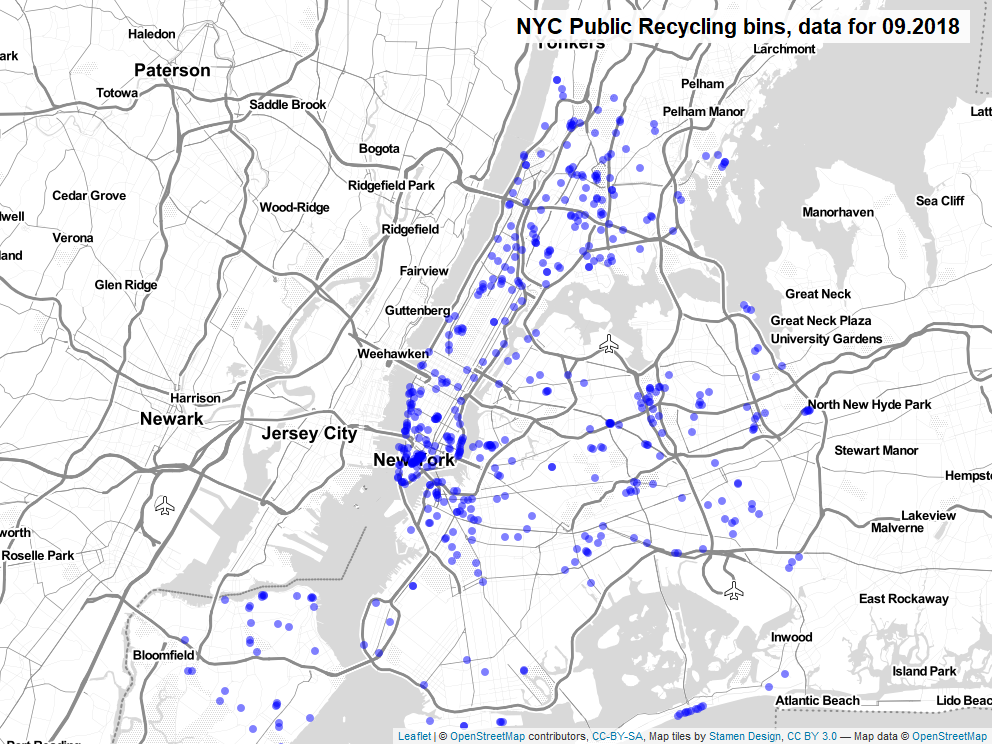

# NYC recycling bins

To finally try my hands on map visualisations, I used this publicly available dataset from [NYC Open Data](https://data.cityofnewyork.us/Environment/Public-Recycling-Bins/sxx4-xhzg)

Data is very nice and tidy so it actually took less than an hour to create a simlpe (interactive when not PNG) plot:

This is using the following libraries:

- lettercase (has a neat substitution for make.names but uses underscores instead!)
- tidyverse
- leaflet
- mapview
- webshot
- htmlwidgets
- htmltools
- magrittr
